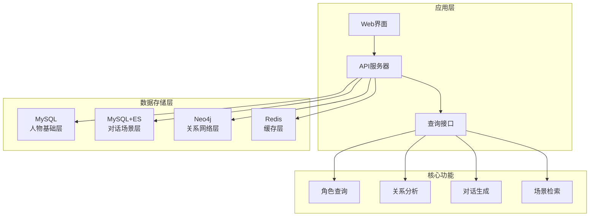
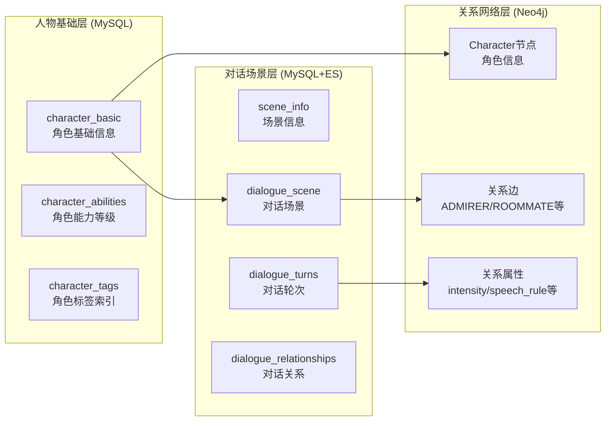
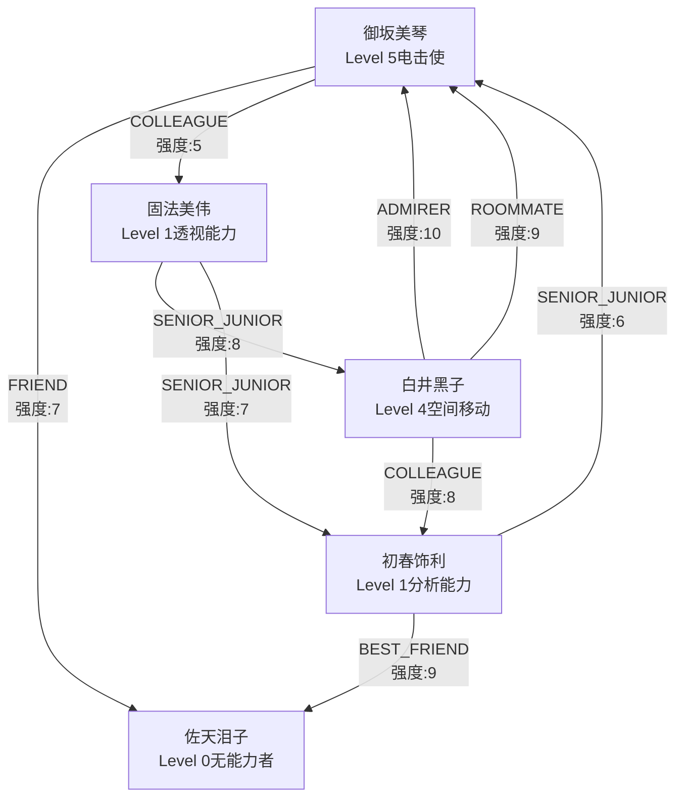
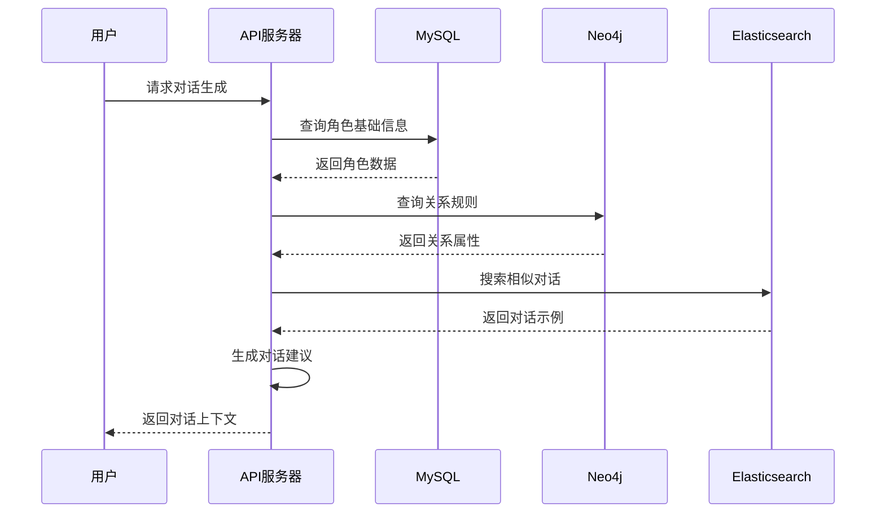
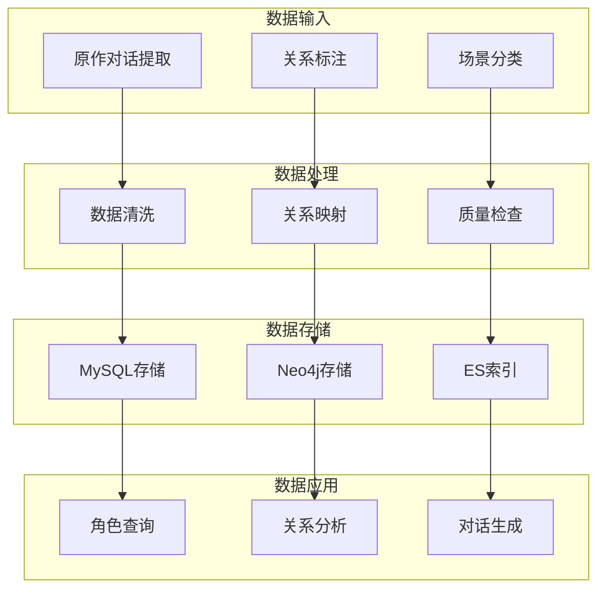
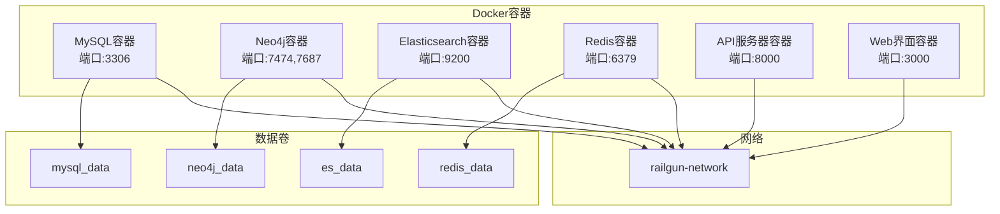
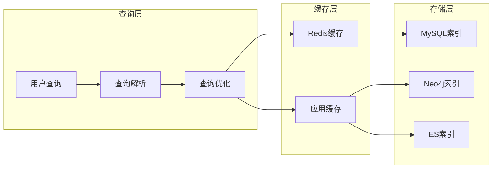

# 《超电磁炮》角色数据库架构图

## 系统整体架构

```mermaid
graph TB
    subgraph "应用层"
        A[Web界面] --> B[API服务器]
        B --> C[查询接口]
    end
    
    subgraph "数据存储层"
        D[MySQL<br/>人物基础层]
        E[MySQL+ES<br/>对话场景层]
        F[Neo4j<br/>关系网络层]
        G[Redis<br/>缓存层]
    end
    
    subgraph "核心功能"
        H[角色查询]
        I[关系分析]
        J[对话生成]
        K[场景检索]
    end
    
    B --> D
    B --> E
    B --> F
    B --> G
    
    C --> H
    C --> I
    C --> J
    C --> K
```

## 数据库三层架构

```mermaid
graph LR
    subgraph "人物基础层 (MySQL)"
        A1[character_basic<br/>角色基础信息]
        A2[character_abilities<br/>角色能力等级]
        A3[character_tags<br/>角色标签索引]
    end
    
    subgraph "对话场景层 (MySQL+ES)"
        B1[scene_info<br/>场景信息]
        B2[dialogue_scene<br/>对话场景]
        B3[dialogue_turns<br/>对话轮次]
        B4[dialogue_relationships<br/>对话关系]
    end
    
    subgraph "关系网络层 (Neo4j)"
        C1[Character节点<br/>角色信息]
        C2[关系边<br/>ADMIRER/ROOMMATE等]
        C3[关系属性<br/>intensity/speech_rule等]
    end
    
    A1 --> B2
    A1 --> C1
    B2 --> C2
    B3 --> C3
```

## 角色关系网络

```mermaid
graph TD
    M[御坂美琴<br/>Level 5电击使]
    K[白井黑子<br/>Level 4空间移动]
    H[初春饰利<br/>Level 1分析能力]
    S[佐天泪子<br/>Level 0无能力者]
    N[固法美伟<br/>Level 1透视能力]
    
    K -->|ADMIRER<br/>强度:10| M
    K -->|ROOMMATE<br/>强度:9| M
    K -->|COLLEAGUE<br/>强度:8| H
    H -->|SENIOR_JUNIOR<br/>强度:6| M
    H -->|BEST_FRIEND<br/>强度:9| S
    M -->|FRIEND<br/>强度:7| S
    N -->|SENIOR_JUNIOR<br/>强度:8| K
    N -->|SENIOR_JUNIOR<br/>强度:7| H
    M -->|COLLEAGUE<br/>强度:5| N
```

## 对话生成流程

```mermaid
sequenceDiagram
    participant U as 用户
    participant A as API服务器
    participant M as MySQL
    participant N as Neo4j
    participant E as Elasticsearch
    
    U->>A: 请求对话生成
    A->>M: 查询角色基础信息
    M-->>A: 返回角色数据
    A->>N: 查询关系规则
    N-->>A: 返回关系属性
    A->>E: 搜索相似对话
    E-->>A: 返回对话示例
    A->>A: 生成对话建议
    A-->>U: 返回对话上下文
```

## 数据流向图

```mermaid
flowchart TD
    subgraph "数据输入"
        D1[原作对话提取]
        D2[关系标注]
        D3[场景分类]
    end
    
    subgraph "数据处理"
        P1[数据清洗]
        P2[关系映射]
        P3[质量检查]
    end
    
    subgraph "数据存储"
        S1[MySQL存储]
        S2[Neo4j存储]
        S3[ES索引]
    end
    
    subgraph "数据应用"
        A1[角色查询]
        A2[关系分析]
        A3[对话生成]
    end
    
    D1 --> P1
    D2 --> P2
    D3 --> P3
    
    P1 --> S1
    P2 --> S2
    P3 --> S3
    
    S1 --> A1
    S2 --> A2
    S3 --> A3
```

## 部署架构

```mermaid
graph TB
    subgraph "Docker容器"
        C1[MySQL容器<br/>端口:3306]
        C2[Neo4j容器<br/>端口:7474,7687]
        C3[Elasticsearch容器<br/>端口:9200]
        C4[Redis容器<br/>端口:6379]
        C5[API服务器容器<br/>端口:8000]
        C6[Web界面容器<br/>端口:3000]
    end
    
    subgraph "数据卷"
        V1[mysql_data]
        V2[neo4j_data]
        V3[es_data]
        V4[redis_data]
    end
    
    subgraph "网络"
        N1[railgun-network]
    end
    
    C1 --> V1
    C2 --> V2
    C3 --> V3
    C4 --> V4
    
    C1 --> N1
    C2 --> N1
    C3 --> N1
    C4 --> N1
    C5 --> N1
    C6 --> N1
```

## 查询优化策略

```mermaid
graph LR
    subgraph "查询层"
        Q1[用户查询]
        Q2[查询解析]
        Q3[查询优化]
    end
    
    subgraph "缓存层"
        C1[Redis缓存]
        C2[应用缓存]
    end
    
    subgraph "存储层"
        S1[MySQL索引]
        S2[Neo4j索引]
        S3[ES索引]
    end
    
    Q1 --> Q2
    Q2 --> Q3
    Q3 --> C1
    Q3 --> C2
    C1 --> S1
    C2 --> S2
    C2 --> S3
```

这个架构图展示了《超电磁炮》角色数据库的完整设计，包括系统架构、数据流向、角色关系网络、对话生成流程等关键组件。
