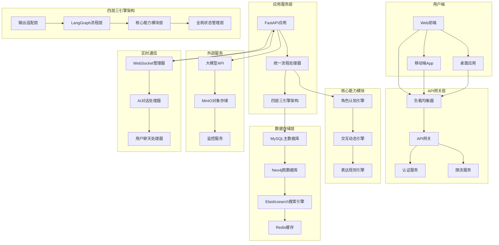
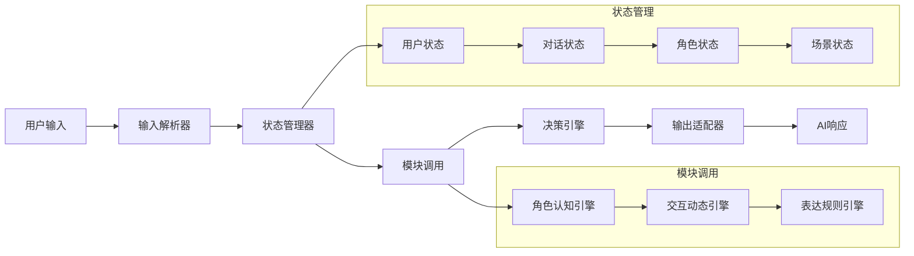
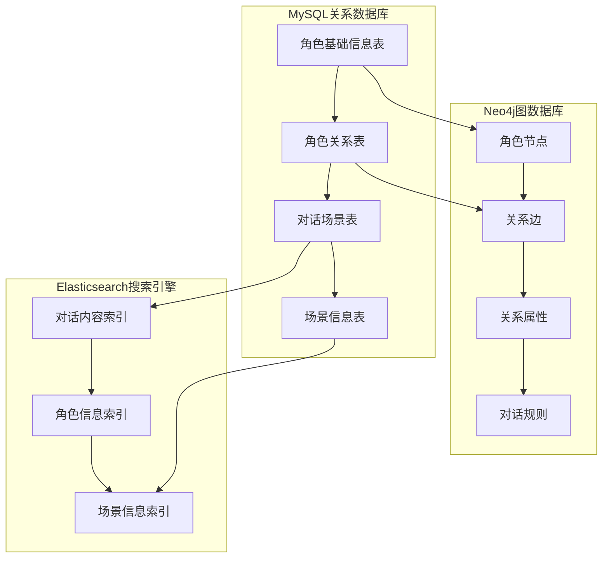
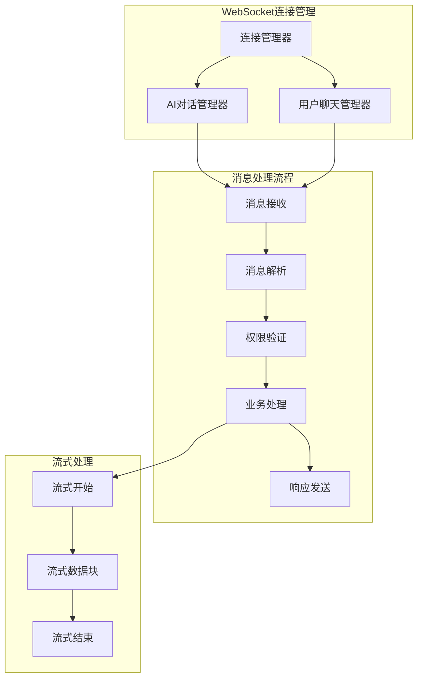
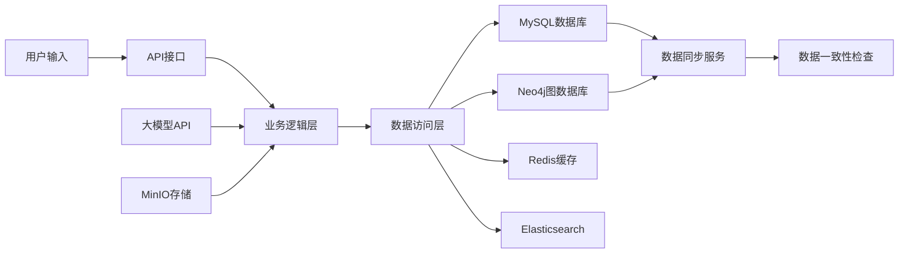
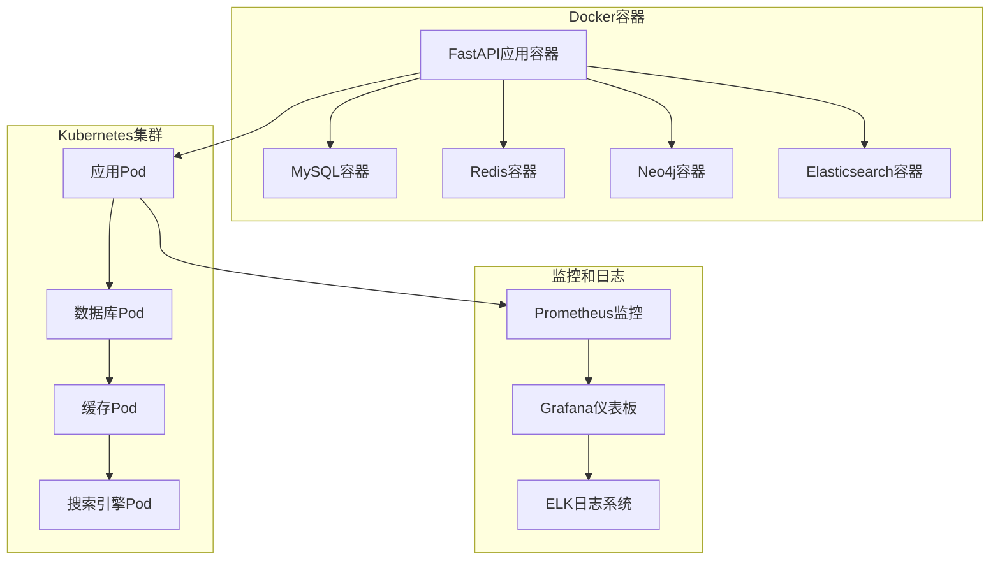
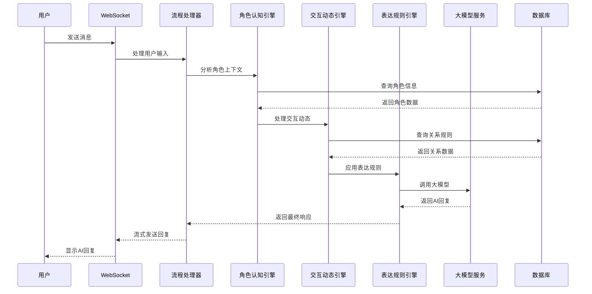
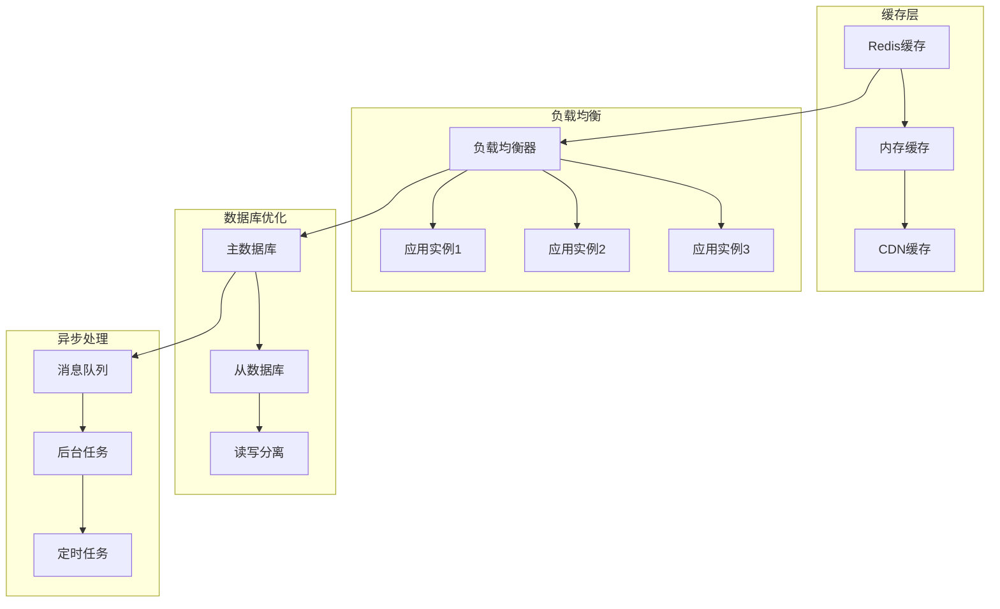

# EchoSoul AI Platform - 系统架构图

## 🏗️ 整体系统架构

## 🔄 统一流程处理架构

## 🎭 角色关系数据库架构

## 🌐 WebSocket实时通信架构

## 📊 数据流架构

## 🔧 部署架构

## 🎯 核心组件交互图

## 📈 性能优化架构

这个架构图展示了EchoSoul AI Platform的完整系统设计，包括：

1. **整体系统架构**：从用户端到数据存储层的完整架构
2. **统一流程处理架构**：核心的AI对话处理流程
3. **角色关系数据库架构**：多数据库协同的存储架构
4. **WebSocket实时通信架构**：实时通信的处理流程
5. **数据流架构**：数据在系统中的流转过程
6. **部署架构**：容器化和集群部署方案
7. **核心组件交互图**：关键组件的交互时序
8. **性能优化架构**：系统性能优化的各个层面

每个架构图都清晰地展示了系统的不同方面，帮助理解整个系统的设计和实现方案。
