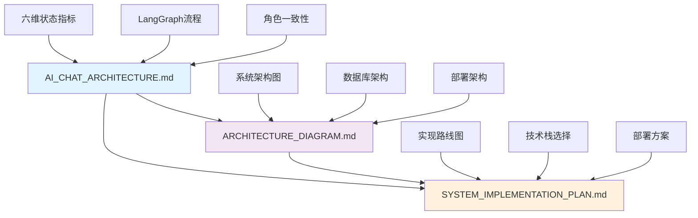

# 系统架构文档集合

本文件夹包含了EchoSoul AI Platform的完整系统架构文档，涵盖了从整体架构设计到具体实现方案的各个方面。

## 📋 文档结构

### 🏗️ 核心架构文档

- **AI_CHAT_ARCHITECTURE.md** - AI对话系统架构设计
  - 六维状态指标系统设计
  - LangGraph对话流程架构
  - 角色一致性保障机制
  - 性能监控与优化策略
  - 完整的御坂美琴实现案例

### 🎨 架构图表

- **ARCHITECTURE_DIAGRAM.md** - 系统架构图表
  - 整体系统架构图
  - 四层三引擎架构图
  - 数据库架构图
  - 部署架构图
  - 组件交互流程图

### 📋 实现方案

- **SYSTEM_IMPLEMENTATION_PLAN.md** - 系统实现方案
  - 项目概述与设计目标
  - 现有系统能力分析
  - 实现路线图
  - 技术栈选择
  - 部署与运维方案

## 🚀 快速导航

### 1. 了解整体架构
首先阅读 `AI_CHAT_ARCHITECTURE.md` 了解AI对话系统的核心设计理念。

### 2. 查看架构图表
通过 `ARCHITECTURE_DIAGRAM.md` 中的各种架构图直观理解系统结构。

### 3. 制定实现计划
参考 `SYSTEM_IMPLEMENTATION_PLAN.md` 了解具体的实现方案和时间规划。

## 📊 文档关系图

## 🔧 技术架构概览

### 核心组件
- **四层三引擎架构**：展示层、服务层、引擎层、存储层
- **六维状态指标**：角色认知、交互动态、表达规则、能力权限、环境场景、情感状态
- **LangGraph流程**：状态驱动的对话处理流程
- **WebSocket实时通信**：支持流式对话体验

### 数据存储
- **MySQL**：结构化数据存储
- **Neo4j**：图关系数据库
- **Redis**：缓存和会话管理

### 部署架构
- **容器化部署**：Docker + Kubernetes
- **微服务架构**：服务解耦和独立扩展
- **负载均衡**：高可用和性能优化

## 📝 使用指南

### 架构设计阶段
1. 阅读 `AI_CHAT_ARCHITECTURE.md` 理解设计理念
2. 查看 `ARCHITECTURE_DIAGRAM.md` 了解架构细节
3. 参考设计文档制定技术方案

### 开发实现阶段
1. 按照 `SYSTEM_IMPLEMENTATION_PLAN.md` 的路线图执行
2. 参考架构文档进行模块开发
3. 使用架构图指导系统集成

### 部署运维阶段
1. 参考部署架构图进行环境搭建
2. 按照实现方案进行系统部署
3. 监控系统运行状态和性能指标

## 🔗 相关文档

- **system_design_docs/** - 详细设计文档
  - 各维度的详细设计规范
  - 情感系统设计
  - 实践案例和数据库设计

- **database_schema/** - 数据库设计文档
  - 数据库表结构设计
  - 查询优化策略
  - 部署指南

## 📞 联系方式

如有问题或建议，请通过项目Issues提交反馈。

---

*最后更新: 2024年*
