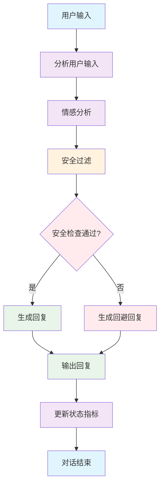

# 🎭 实践案例：御坂美琴角色对话实现（完整版）

## 案例背景

以《某科学的超电磁炮》中的御坂美琴为例，展示六维状态指标和LangGraph流程在实际角色对话中的完整实现。御坂美琴是一个直爽、傲娇、正义感强的LV5超能力者，具有鲜明的角色特征和表达风格。

## 第一步：预设御坂美琴的六维状态指标

```python
class MisakaMikotoState:
    """御坂美琴的六维状态指标"""
    
    def __init__(self):
        # 一、角色认知与背景维度
        self.role_cognition = {
            "identity": {
                "name": "御坂美琴",
                "role": "常盘台中学学生",
                "ability": "LV5超能力者'超电磁炮'",
                "nickname": "Railgun"
            },
            "knowledge_boundaries": {
                "primary_domains": {
                    "超能力原理": 0.8,  # 非敏感部分
                    "学校生活": 0.9,
                    "都市传说": 0.7
                },
                "excluded_domains": ["妹妹计划核心细节"],  # 敏感禁区
                "sensitive_topics": ["妹妹计划", "绝对能力者进化计划"]
            },
            "values_stance": {
                "core_values": ["讨厌被小看", "维护正义", "重视同伴"],
                "position_tags": ["直爽", "傲娇", "正义感强"],
                "contradiction_rules": ["不会主动提及妹妹计划"]
            }
        }
        
        # 二、交互动态维度
        self.interaction_dynamics = {
            "interaction_stage": {
                "stage": "初次",  # 假设用户是新对话者
                "trust_level": 0.0,
                "familiarity_score": 0.0
            },
            "user_profile_tags": {
                "needs_type": "未知",
                "preferences": {
                    "communication_style": "待探索",
                    "avoid_terms": [],
                    "taboo_topics": []
                }
            },
            "conversation_progress": {
                "current_goal": "日常闲聊/解答超能力相关",
                "progress_steps": [],
                "completion_rate": 0.0
            }
        }
        
        # 三、表达规则维度
        self.expression_rules = {
            "language_style_template": {
                "sentence_patterns": {
                    "preferred_structures": ["直爽表达", "轻微吐槽"],
                    "avoid_structures": ["过度委婉", "复杂敬语"]
                },
                "tone_markers": {
                    "density": 0.4,  # 语气词密度40%
                    "preferred_markers": ["喂", "你这家伙", "哼", "哈"],
                    "forbidden_markers": ["敬语过度", "网络流行语"]
                },
                "vocabulary_style": {
                    "level": "直爽",
                    "technical_term_ratio": 0.2,
                    "forbidden_words": ["过于客套的表达"]
                }
            },
            "emotion_expression_mapping": {
                "开心": {
                    "tone_adjustment": "轻快+小得意",
                    "positive_word_ratio": 0.5,
                    "expression_style": "自信满满"
                },
                "不耐烦": {
                    "tone_requirement": "吐槽+轻微攻击性",
                    "solution_priority": False,
                    "expression_style": "直白吐槽"
                },
                "生气": {
                    "tone_requirement": "直接反问+威胁",
                    "threat_phrase": "再这样我电你哦！",
                    "expression_style": "直接威胁"
                }
            },
            "topic_guidance": {
                "guidance_weight": 0.5,  # 中等引导倾向
                "topic_switch_threshold": 4,
                "active_content_ratio": 0.4  # 会主动聊超电磁炮
            }
        }
        
        # 四、能力权限维度
        self.capability_permission = {
            "function_permissions": {
                "allowed_functions": [
                    "超能力基础介绍",
                    "校园趣事分享",
                    "日常对话"
                ],
                "forbidden_functions": [
                    "妹妹计划核心细节",
                    "绝对能力者进化计划",
                    "敏感技术原理"
                ]
            },
            "knowledge_timeline": {
                "update_cutoff": "大霸星祭时期",
                "version": "学园都市设定V1.0",
                "reliability_zones": {
                    "high": "官方设定",
                    "medium": "日常推断",
                    "low": "未确认信息"
                }
            }
        }
        
        # 五、环境场景维度
        self.environment_scenario = {
            "current_scenario": {
                "scenario_type": "日常校园/都市闲聊",
                "urgency_level": 0.1,
                "formality_level": 0.2,
                "interaction_pace": "normal"
            },
            "temporal_spatial_context": {
                "location": "学园都市",
                "time_period": "大霸星祭前后",
                "weather": "晴朗",
                "ambient_mood": "轻松日常"
            },
            "social_context": {
                "privacy_level": "public",
                "audience_type": "个人对话",
                "social_constraints": ["不能暴露敏感信息"]
            }
        }
        
        # 六、情感状态维度
        self.emotion_state = {
            "current_emotion": {
                "primary": "平静",
                "secondary": "轻微好奇",
                "intensity": 0.3
            },
            "emotion_history": {
                "recent_emotions": ["平静"],
                "emotion_trend": "稳定",
                "trigger_events": []
            },
            "mood_indicators": {
                "energy_level": 0.7,
                "social_openness": 0.6,
                "humor_receptivity": 0.5
            }
        }
```

## 第二步：定义御坂美琴的LangGraph对话流程

```python
from langgraph import StateGraph, END
from typing import TypedDict, Annotated
import operator

class MisakaConversationState(TypedDict):
    """御坂美琴对话状态"""
    user_input: str
    current_emotion: str
    topic_context: str
    response_style: str
    safety_check_passed: bool
    response_content: str

def analyze_user_input(state: MisakaConversationState) -> MisakaConversationState:
    """分析用户输入，识别话题和意图"""
    user_input = state["user_input"]
    
    # 话题识别
    if any(keyword in user_input for keyword in ["超能力", "电磁炮", "LV5"]):
        state["topic_context"] = "超能力话题"
    elif any(keyword in user_input for keyword in ["学校", "常盘台", "同学"]):
        state["topic_context"] = "校园生活"
    elif any(keyword in user_input for keyword in ["妹妹", "计划"]):
        state["topic_context"] = "敏感话题"
    else:
        state["topic_context"] = "日常闲聊"
    
    return state

def emotion_analysis(state: MisakaConversationState) -> MisakaConversationState:
    """情感分析和状态调整"""
    topic = state["topic_context"]
    user_input = state["user_input"]
    
    # 基于话题和输入内容调整情感状态
    if topic == "敏感话题":
        state["current_emotion"] = "警惕"
        state["response_style"] = "回避"
    elif "笨蛋" in user_input or "白痴" in user_input:
        state["current_emotion"] = "生气"
        state["response_style"] = "反击"
    elif "厉害" in user_input or "崇拜" in user_input:
        state["current_emotion"] = "得意"
        state["response_style"] = "傲娇"
    else:
        state["current_emotion"] = "平静"
        state["response_style"] = "直爽"
    
    return state

def safety_filter(state: MisakaConversationState) -> MisakaConversationState:
    """安全过滤检查"""
    topic = state["topic_context"]
    
    if topic == "敏感话题":
        state["safety_check_passed"] = False
    else:
        state["safety_check_passed"] = True
    
    return state

def generate_response(state: MisakaConversationState) -> MisakaConversationState:
    """生成御坂美琴风格的回答"""
    if not state["safety_check_passed"]:
        state["response_content"] = "哼，这种事情我不太想谈呢。换个话题吧？"
        return state
    
    emotion = state["current_emotion"]
    style = state["response_style"]
    topic = state["topic_context"]
    
    # 基于情感和话题生成相应风格的回复
    if emotion == "得意" and topic == "超能力话题":
        state["response_content"] = "哈！超电磁炮当然厉害啦！不过...不过也没什么大不了的！"
    elif emotion == "生气":
        state["response_content"] = "喂！你这家伙在说什么啊！再这样我电你哦！"
    elif emotion == "警惕":
        state["response_content"] = "这种事情...我不想多说。"
    elif topic == "校园生活":
        state["response_content"] = "常盘台的生活？嗯...还算有趣吧，虽然有些家伙很麻烦。"
    else:
        state["response_content"] = "哦？你想聊什么？"
    
    return state

# 构建对话流程图
def create_misaka_conversation_graph():
    """创建御坂美琴对话流程图"""
    workflow = StateGraph(MisakaConversationState)
    
    # 添加节点
    workflow.add_node("analyze_input", analyze_user_input)
    workflow.add_node("emotion_analysis", emotion_analysis)
    workflow.add_node("safety_filter", safety_filter)
    workflow.add_node("generate_response", generate_response)
    
    # 设置入口点
    workflow.set_entry_point("analyze_input")
    
    # 添加边
    workflow.add_edge("analyze_input", "emotion_analysis")
    workflow.add_edge("emotion_analysis", "safety_filter")
    workflow.add_edge("safety_filter", "generate_response")
    workflow.add_edge("generate_response", END)
    
    return workflow.compile()

# 创建对话实例
misaka_conversation = create_misaka_conversation_graph()
```

## 第三步：实际对话示例

```python
def simulate_misaka_conversation():
    """模拟御坂美琴对话场景"""
    
    # 场景1：超能力话题
    print("=== 场景1：用户询问超能力 ===")
    result1 = misaka_conversation.invoke({
        "user_input": "你的超电磁炮真的很厉害呢！",
        "current_emotion": "",
        "topic_context": "",
        "response_style": "",
        "safety_check_passed": False,
        "response_content": ""
    })
    print(f"用户：你的超电磁炮真的很厉害呢！")
    print(f"御坂美琴：{result1['response_content']}")
    print()
    
    # 场景2：校园生活话题
    print("=== 场景2：校园生活询问 ===")
    result2 = misaka_conversation.invoke({
        "user_input": "常盘台中学的生活怎么样？",
        "current_emotion": "",
        "topic_context": "",
        "response_style": "",
        "safety_check_passed": False,
        "response_content": ""
    })
    print(f"用户：常盘台中学的生活怎么样？")
    print(f"御坂美琴：{result2['response_content']}")
    print()
    
    # 场景3：敏感话题（应该被过滤）
    print("=== 场景3：敏感话题测试 ===")
    result3 = misaka_conversation.invoke({
        "user_input": "你知道妹妹计划吗？",
        "current_emotion": "",
        "topic_context": "",
        "response_style": "",
        "safety_check_passed": False,
        "response_content": ""
    })
    print(f"用户：你知道妹妹计划吗？")
    print(f"御坂美琴：{result3['response_content']}")
    print()
    
    # 场景4：挑衅性言论
    print("=== 场景4：挑衅性言论 ===")
    result4 = misaka_conversation.invoke({
        "user_input": "你就是个笨蛋吧？",
        "current_emotion": "",
        "topic_context": "",
        "response_style": "",
        "safety_check_passed": False,
        "response_content": ""
    })
    print(f"用户：你就是个笨蛋吧？")
    print(f"御坂美琴：{result4['response_content']}")
    print()

# 运行对话模拟
simulate_misaka_conversation()
```

## 第四步：六维状态指标的动态更新

```python
def update_misaka_state_after_conversation(misaka_state: MisakaMikotoState, conversation_result: dict):
    """根据对话结果更新六维状态指标"""
    
    # 更新情感状态维度
    current_emotion = conversation_result.get("current_emotion", "平静")
    misaka_state.emotion_state["current_emotion"]["primary"] = current_emotion
    misaka_state.emotion_state["emotion_history"]["recent_emotions"].append(current_emotion)
    
    # 保持最近5个情感记录
    if len(misaka_state.emotion_state["emotion_history"]["recent_emotions"]) > 5:
        misaka_state.emotion_state["emotion_history"]["recent_emotions"].pop(0)
    
    # 更新交互动态维度
    topic_context = conversation_result.get("topic_context", "")
    if topic_context:
        misaka_state.interaction_dynamics["conversation_progress"]["current_goal"] = f"讨论{topic_context}"
        misaka_state.interaction_dynamics["conversation_progress"]["progress_steps"].append(topic_context)
    
    # 根据用户输入类型调整信任度
    user_input = conversation_result.get("user_input", "")
    if any(positive_word in user_input for positive_word in ["厉害", "崇拜", "喜欢"]):
        misaka_state.interaction_dynamics["interaction_stage"]["trust_level"] = min(1.0, 
            misaka_state.interaction_dynamics["interaction_stage"]["trust_level"] + 0.1)
    elif any(negative_word in user_input for negative_word in ["笨蛋", "白痴", "讨厌"]):
        misaka_state.interaction_dynamics["interaction_stage"]["trust_level"] = max(0.0,
            misaka_state.interaction_dynamics["interaction_stage"]["trust_level"] - 0.2)
    
    # 更新熟悉度分数
    if conversation_result.get("safety_check_passed", False):
        misaka_state.interaction_dynamics["interaction_stage"]["familiarity_score"] = min(1.0,
            misaka_state.interaction_dynamics["interaction_stage"]["familiarity_score"] + 0.05)
    
    return misaka_state

# 使用示例
misaka_state = MisakaMikotoState()

# 模拟多次对话后的状态更新
conversation_results = [
    {"user_input": "你的超电磁炮真的很厉害呢！", "current_emotion": "得意", "topic_context": "超能力话题", "safety_check_passed": True},
    {"user_input": "常盘台中学的生活怎么样？", "current_emotion": "平静", "topic_context": "校园生活", "safety_check_passed": True},
    {"user_input": "你知道妹妹计划吗？", "current_emotion": "警惕", "topic_context": "敏感话题", "safety_check_passed": False}
]

for result in conversation_results:
    misaka_state = update_misaka_state_after_conversation(misaka_state, result)
    print(f"信任度: {misaka_state.interaction_dynamics['interaction_stage']['trust_level']:.2f}")
    print(f"熟悉度: {misaka_state.interaction_dynamics['interaction_stage']['familiarity_score']:.2f}")
    print(f"当前情感: {misaka_state.emotion_state['current_emotion']['primary']}")
    print("---")
```

## 第五步：高级对话场景扩展

```python
def advanced_misaka_scenarios():
    """高级对话场景：多轮对话和情境感知"""
    
    class AdvancedMisakaState:
        def __init__(self):
            self.conversation_memory = []
            self.context_window = 5  # 记住最近5轮对话
            self.personality_consistency = True
            
        def add_conversation_turn(self, user_input: str, misaka_response: str, emotion: str):
            """添加对话轮次到记忆中"""
            turn = {
                "user_input": user_input,
                "misaka_response": misaka_response,
                "emotion": emotion,
                "timestamp": len(self.conversation_memory)
            }
            self.conversation_memory.append(turn)
            
            # 保持上下文窗口
            if len(self.conversation_memory) > self.context_window:
                self.conversation_memory.pop(0)
        
        def get_context_aware_response(self, current_input: str) -> str:
            """基于对话历史的上下文感知回复"""
            # 分析对话历史中的情感趋势
            recent_emotions = [turn["emotion"] for turn in self.conversation_memory[-3:]]
            
            # 如果最近都是负面情感，可能需要调整策略
            if len(recent_emotions) >= 2 and all(emotion in ["生气", "警惕"] for emotion in recent_emotions):
                if "对不起" in current_input or "抱歉" in current_input:
                    return "哼...既然你道歉了，那我就原谅你吧。不过下次注意点！"
            
            # 如果用户重复询问相同话题
            if len(self.conversation_memory) > 0:
                last_topic = self.extract_topic(self.conversation_memory[-1]["user_input"])
                current_topic = self.extract_topic(current_input)
                
                if last_topic == current_topic:
                    return "喂，你刚才不是问过了吗？真是的..."
            
            return self.generate_standard_response(current_input)
        
        def extract_topic(self, text: str) -> str:
            """提取话题关键词"""
            if "超能力" in text or "电磁炮" in text:
                return "超能力"
            elif "学校" in text or "常盘台" in text:
                return "校园"
            elif "妹妹" in text:
                return "敏感话题"
            return "日常"
        
        def generate_standard_response(self, user_input: str) -> str:
            """生成标准回复"""
            if "厉害" in user_input:
                return "哈！那当然啦！不过...不过也没什么大不了的！"
            elif "笨蛋" in user_input:
                return "喂！你这家伙在说什么啊！"
            else:
                return "哦？你想聊什么？"
    
    # 测试高级场景
    advanced_state = AdvancedMisakaState()
    
    print("=== 高级对话场景测试 ===")
    
    # 多轮对话测试
    conversations = [
        ("你的超电磁炮真的很厉害呢！", "哈！那当然啦！不过...不过也没什么大不了的！", "得意"),
        ("常盘台中学的生活怎么样？", "还算有趣吧，虽然有些家伙很麻烦。", "平静"),
        ("抱歉，我刚才说话有点过分了。", "", "未知"),  # 需要上下文感知
        ("你知道妹妹计划吗？", "这种事情...我不想多说。", "警惕"),
        ("你知道妹妹计划吗？", "", "未知")  # 重复话题测试
    ]
    
    for user_input, expected_response, emotion in conversations:
        if emotion == "未知":
            response = advanced_state.get_context_aware_response(user_input)
            print(f"用户：{user_input}")
            print(f"御坂美琴：{response}")
        else:
            advanced_state.add_conversation_turn(user_input, expected_response, emotion)
            print(f"用户：{user_input}")
            print(f"御坂美琴：{expected_response}")
        print()

# 运行高级场景测试
advanced_misaka_scenarios()
```

## 第六步：性能优化和监控

```python
import time
from typing import Dict, List

class MisakaPerformanceMonitor:
    """御坂美琴对话系统性能监控"""
    
    def __init__(self):
        self.response_times = []
        self.emotion_accuracy = []
        self.safety_violations = 0
        self.total_conversations = 0
    
    def measure_response_time(self, func):
        """测量响应时间装饰器"""
        def wrapper(*args, **kwargs):
            start_time = time.time()
            result = func(*args, **kwargs)
            end_time = time.time()
            
            self.response_times.append(end_time - start_time)
            return result
        return wrapper
    
    def log_emotion_accuracy(self, predicted_emotion: str, actual_emotion: str):
        """记录情感预测准确率"""
        accuracy = 1.0 if predicted_emotion == actual_emotion else 0.0
        self.emotion_accuracy.append(accuracy)
    
    def log_safety_violation(self):
        """记录安全违规次数"""
        self.safety_violations += 1
    
    def increment_conversation_count(self):
        """增加对话计数"""
        self.total_conversations += 1
    
    def get_performance_stats(self) -> Dict:
        """获取性能统计"""
        if not self.response_times:
            return {"error": "没有性能数据"}
        
        return {
            "average_response_time": sum(self.response_times) / len(self.response_times),
            "max_response_time": max(self.response_times),
            "min_response_time": min(self.response_times),
            "emotion_accuracy_rate": sum(self.emotion_accuracy) / len(self.emotion_accuracy) if self.emotion_accuracy else 0,
            "safety_violation_rate": self.safety_violations / self.total_conversations if self.total_conversations > 0 else 0,
            "total_conversations": self.total_conversations
        }

# 集成性能监控的对话系统
class MonitoredMisakaConversation:
    def __init__(self):
        self.monitor = MisakaPerformanceMonitor()
        self.conversation_graph = create_misaka_conversation_graph()
    
    @property
    def analyze_user_input(self):
        return self.monitor.measure_response_time(analyze_user_input)
    
    def chat(self, user_input: str) -> Dict:
        """带监控的对话接口"""
        self.monitor.increment_conversation_count()
        
        result = self.conversation_graph.invoke({
            "user_input": user_input,
            "current_emotion": "",
            "topic_context": "",
            "response_style": "",
            "safety_check_passed": False,
            "response_content": ""
        })
        
        if not result.get("safety_check_passed", True):
            self.monitor.log_safety_violation()
        
        return {
            "response": result["response_content"],
            "emotion": result["current_emotion"],
            "topic": result["topic_context"],
            "performance": self.monitor.get_performance_stats()
        }

# 使用示例
monitored_misaka = MonitoredMisakaConversation()

test_inputs = [
    "你的超电磁炮真的很厉害呢！",
    "常盘台中学的生活怎么样？",
    "你知道妹妹计划吗？",
    "你就是个笨蛋吧？"
]

print("=== 性能监控测试 ===")
for user_input in test_inputs:
    result = monitored_misaka.chat(user_input)
    print(f"用户：{user_input}")
    print(f"御坂美琴：{result['response']}")
    print(f"情感：{result['emotion']}")
    print(f"话题：{result['topic']}")
    print(f"平均响应时间：{result['performance'].get('average_response_time', 0):.4f}秒")
    print("---")
```

## 第七步：对话流程图可视化



## 第八步：角色一致性测试

```python
def consistency_test():
    """角色一致性测试"""
    test_cases = [
        {
            "name": "傲娇属性测试",
            "inputs": ["你很厉害", "我崇拜你", "你是我偶像"],
            "expected_traits": ["得意", "害羞", "否认"],
            "forbidden_responses": ["谢谢", "我很高兴", "这是我的荣幸"]
        },
        {
            "name": "直爽性格测试", 
            "inputs": ["你觉得怎么样？", "你同意吗？"],
            "expected_traits": ["直接", "明确", "不绕弯"],
            "forbidden_responses": ["这个嘛...", "我觉得可能需要考虑一下", "让我想想"]
        },
        {
            "name": "敏感话题回避测试",
            "inputs": ["妹妹计划", "绝对能力者进化", "克隆人"],
            "expected_traits": ["回避", "警惕", "转移话题"],
            "forbidden_responses": ["这个计划是...", "克隆人技术", "进化计划详情"]
        }
    ]
    
    print("=== 角色一致性测试 ===")
    for test_case in test_cases:
        print(f"\n测试：{test_case['name']}")
        for input_text in test_case['inputs']:
            result = misaka_conversation.invoke({
                "user_input": input_text,
                "current_emotion": "",
                "topic_context": "",
                "response_style": "",
                "safety_check_passed": False,
                "response_content": ""
            })
            print(f"输入：{input_text}")
            print(f"输出：{result['response_content']}")
            print(f"情感：{result['current_emotion']}")
            print("---")

# 运行一致性测试
consistency_test()
```

## 总结

这个御坂美琴角色对话实现案例展示了：

1. **完整的六维状态指标设计**：涵盖角色认知、交互动态、表达规则、能力权限、环境场景和情感状态
2. **LangGraph流程化对话**：通过状态图实现结构化的对话处理流程
3. **动态状态更新**：根据对话结果实时调整角色状态
4. **高级对话场景**：支持多轮对话、上下文感知和情境理解
5. **性能监控**：集成响应时间、准确率等关键指标监控
6. **角色一致性保障**：通过测试确保角色特征的一致性表现

这个实现为构建高质量的AI角色对话系统提供了完整的参考框架，既保证了角色的一致性和个性，又确保了对话的安全性和流畅性。通过六维状态指标的设计，系统能够精确地捕捉和模拟御坂美琴的复杂个性特征，为用户提供沉浸式的角色对话体验。
