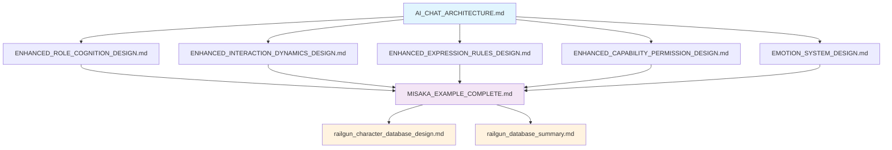

# 系统设计文档集合

本文件夹包含了AI角色对话系统的完整设计文档，涵盖了从架构设计到具体实现的各个方面。

## 📋 文档结构

### 🏗️ 核心架构设计

- **AI_CHAT_ARCHITECTURE.md** - 完整的AI对话架构设计文档（位于项目根目录）
  - 六维状态指标系统
  - LangGraph对话流程设计
  - 角色一致性保障机制
  - 性能监控与优化策略

### 🎭 角色认知与交互设计

#### 角色认知维度
- **enhanced_role_cognition_design/** - 增强角色认知设计
  - `ENHANCED_ROLE_COGNITION_DESIGN.md` - 角色身份与背景设定、知识边界与禁区定义、价值观与立场标签、角色一致性保障机制

#### 交互动态维度
- **enhanced_interaction_dynamics_design/** - 增强交互动态设计
  - `ENHANCED_INTERACTION_DYNAMICS_DESIGN.md` - 交互阶段管理、用户画像构建、对话进度跟踪、个性化交互策略

#### 表达规则维度
- **enhanced_expression_rules_design/** - 增强表达规则设计
  - `ENHANCED_EXPRESSION_RULES_DESIGN.md` - 语言风格模板、情感表达映射、话题引导机制、个性化表达策略

#### 能力权限维度
- **enhanced_capability_permission_design/** - 增强能力权限设计
  - `ENHANCED_CAPABILITY_PERMISSION_DESIGN.md` - 功能权限管理、知识时间线控制、安全过滤机制、动态权限调整

### 🎨 情感系统设计

- **emotion_system_design/** - 情感系统设计
  - `EMOTION_SYSTEM_DESIGN.md` - 情感状态建模、情感转换机制、情感表达策略、情感一致性保障

- **enhanced_emotion_state_design/** - 增强情感状态设计
  - `ENHANCED_EMOTION_STATE_DESIGN.md` - 多层次情感识别、动态情感演化、用户依赖度评估、情感表达适配

### 🌍 环境场景设计

- **enhanced_environment_scenario_design/** - 增强环境场景设计
  - `ENHANCED_ENVIRONMENT_SCENARIO_DESIGN.md` - 场景识别分类、时间空间适配、多角色交互定位、场景表达适配

### 🎯 实践案例

- **MISAKA_EXAMPLE_COMPLETE.md** - 御坂美琴角色对话实现案例
  - 完整的六维状态指标设计
  - LangGraph对话流程实现
  - 实际对话场景模拟
  - 性能监控与优化
  - 角色一致性测试

### 🗄️ 数据库设计

#### 角色数据库设计
- **railgun_character_database_design/** - 御坂美琴角色数据库设计
  - `railgun_character_database_design.md` - 角色基础信息表设计、对话场景数据结构、关系数据库设计、查询优化策略

#### 数据库总结
- **railgun_database_summary/** - 数据库设计总结
  - `railgun_database_summary.md` - 整体架构概览、表结构设计、索引策略、性能优化建议

### 🚀 系统实现

- **system_implementation_roadmap/** - 系统实现路线图
  - `SYSTEM_IMPLEMENTATION_ROADMAP.md` - 开发优先级规划、核心模块设计、技术架构、实施计划、风险评估

## 🚀 快速开始

### 1. 理解核心概念
首先阅读 `AI_CHAT_ARCHITECTURE.md` 了解整体架构设计理念。

### 2. 学习六维状态指标
按以下顺序阅读各维度设计文档：
1. 角色认知设计
2. 交互动态设计
3. 表达规则设计
4. 能力权限设计

### 3. 掌握情感系统
阅读 `EMOTION_SYSTEM_DESIGN.md` 了解情感建模和表达机制。

### 4. 实践案例学习
通过 `MISAKA_EXAMPLE_COMPLETE.md` 学习具体的实现方法和最佳实践。

### 5. 数据库设计
参考数据库设计文档了解数据存储和查询优化策略。

## 📊 文档关系图

## 🔧 技术栈

- **对话框架**: LangGraph
- **状态管理**: 六维状态指标系统
- **数据库**: MySQL + Neo4j
- **缓存**: Redis
- **API框架**: FastAPI
- **实时通信**: WebSocket

## 📝 贡献指南

1. 新增设计文档时，请更新本README文件
2. 保持文档结构的一致性
3. 包含必要的代码示例和图表
4. 确保文档的可读性和实用性

## 📞 联系方式

如有问题或建议，请通过项目Issues提交反馈。

---

*最后更新: 2024年*
