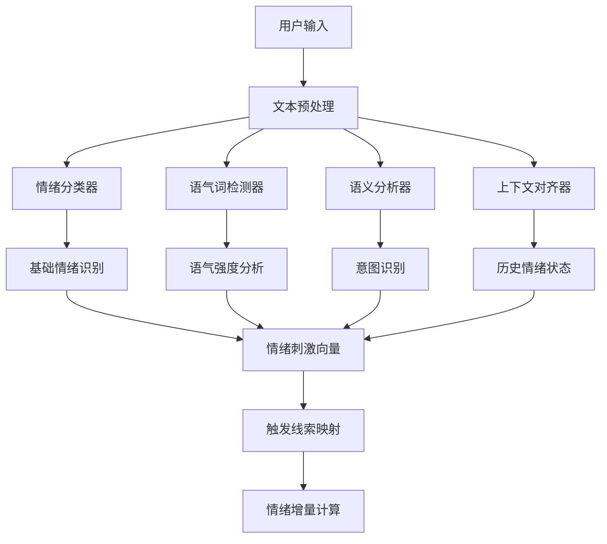

# AI角色情感系统设计方案

## 概述

本文档基于现有AI聊天架构，提出了一套完整的情感系统设计方案，解决用户输入映射、情绪状态转换、以及情绪到行为表达的关键问题。

## 1. 用户输入到情绪数值的映射机制

### 1.1 多层次输入解析架构



### 1.2 输入解析组件设计

#### 1.2.1 情绪分类器
```python
class EmotionClassifier:
    """情绪分类器 - 识别基础情绪类型"""
    
    def __init__(self):
        self.emotion_types = {
            "快乐": {"keywords": ["开心", "高兴", "哈哈", "太好了"], "weight": 1.0},
            "悲伤": {"keywords": ["难过", "伤心", "哭", "痛苦"], "weight": 1.0},
            "愤怒": {"keywords": ["生气", "愤怒", "讨厌", "烦"], "weight": 1.0},
            "恐惧": {"keywords": ["害怕", "恐惧", "吓", "担心"], "weight": 1.0},
            "惊讶": {"keywords": ["惊讶", "震惊", "什么", "真的"], "weight": 1.0},
            "厌恶": {"keywords": ["恶心", "讨厌", "反感", "嫌弃"], "weight": 1.0},
            "平静": {"keywords": ["平静", "冷静", "淡定", "正常"], "weight": 1.0}
        }
    
    def classify_emotion(self, text: str) -> dict:
        """分类用户输入的情绪"""
        emotion_scores = {}
        for emotion, config in self.emotion_types.items():
            score = 0
            for keyword in config["keywords"]:
                if keyword in text:
                    score += config["weight"]
            emotion_scores[emotion] = min(score / len(config["keywords"]), 1.0)
        
        return emotion_scores
```

#### 1.2.2 语气强度分析器
```python
class ToneIntensityAnalyzer:
    """语气强度分析器 - 分析语气词的强度"""
    
    def __init__(self):
        self.tone_markers = {
            "感叹号": {"pattern": r"[！!]+", "intensity": 0.3},
            "问号": {"pattern": r"[？?]+", "intensity": 0.2},
            "省略号": {"pattern": r"[。.]{3,}", "intensity": 0.1},
            "重复字符": {"pattern": r"(.)\1{2,}", "intensity": 0.4},
            "大写": {"pattern": r"[A-Z]{3,}", "intensity": 0.5}
        }
    
    def analyze_intensity(self, text: str) -> float:
        """分析语气强度"""
        total_intensity = 0
        for marker, config in self.tone_markers.items():
            matches = len(re.findall(config["pattern"], text))
            total_intensity += matches * config["intensity"]
        
        return min(total_intensity, 1.0)
```

#### 1.2.3 触发线索映射器
```python
class TriggerClueMapper:
    """触发线索映射器 - 将输入特征映射为情绪增量"""
    
    def __init__(self):
        self.trigger_mapping = {
            # 积极线索
            "gratitude": {
                "keywords": ["谢谢", "感谢", "多亏", "幸好"],
                "emotion_delta": {"快乐": 0.8, "平静": 0.3},
                "valence_delta": 0.5,
                "arousal_delta": 0.2
            },
            "praise": {
                "keywords": ["厉害", "棒", "优秀", "完美"],
                "emotion_delta": {"快乐": 1.2, "惊讶": 0.3},
                "valence_delta": 0.8,
                "arousal_delta": 0.4
            },
            
            # 消极线索
            "criticism": {
                "keywords": ["不好", "差", "糟糕", "错误"],
                "emotion_delta": {"愤怒": 1.0, "悲伤": 0.5},
                "valence_delta": -0.6,
                "arousal_delta": 0.3
            },
            "fear": {
                "keywords": ["害怕", "恐惧", "吓", "担心"],
                "emotion_delta": {"恐惧": 1.5, "平静": -0.8},
                "valence_delta": -0.7,
                "arousal_delta": 0.6
            },
            
            # 中性线索
            "question": {
                "keywords": ["什么", "怎么", "为什么", "如何"],
                "emotion_delta": {"惊讶": 0.4, "平静": 0.2},
                "valence_delta": 0.0,
                "arousal_delta": 0.1
            }
        }
    
    def map_trigger_clues(self, text: str, emotion_scores: dict, tone_intensity: float) -> dict:
        """映射触发线索到情绪增量"""
        trigger_results = {
            "emotion_deltas": {},
            "valence_delta": 0,
            "arousal_delta": 0,
            "trigger_clues": []
        }
        
        for trigger, config in self.trigger_mapping.items():
            for keyword in config["keywords"]:
                if keyword in text:
                    trigger_results["trigger_clues"].append(trigger)
                    
                    # 应用情绪增量
                    for emotion, delta in config["emotion_delta"].items():
                        if emotion not in trigger_results["emotion_deltas"]:
                            trigger_results["emotion_deltas"][emotion] = 0
                        trigger_results["emotion_deltas"][emotion] += delta * tone_intensity
                    
                    # 应用效价和唤醒度增量
                    trigger_results["valence_delta"] += config["valence_delta"] * tone_intensity
                    trigger_results["arousal_delta"] += config["arousal_delta"] * tone_intensity
        
        return trigger_results
```

### 1.3 情绪刺激向量生成

```python
class EmotionStimulusVector:
    """情绪刺激向量 - 整合所有输入分析结果"""
    
    def __init__(self):
        self.emotion_classifier = EmotionClassifier()
        self.tone_analyzer = ToneIntensityAnalyzer()
        self.trigger_mapper = TriggerClueMapper()
    
    def generate_stimulus_vector(self, user_input: str, context: dict = None) -> dict:
        """生成情绪刺激向量"""
        # 1. 基础情绪分类
        emotion_scores = self.emotion_classifier.classify_emotion(user_input)
        
        # 2. 语气强度分析
        tone_intensity = self.tone_analyzer.analyze_intensity(user_input)
        
        # 3. 触发线索映射
        trigger_results = self.trigger_mapper.map_trigger_clues(
            user_input, emotion_scores, tone_intensity
        )
        
        # 4. 生成刺激向量
        stimulus_vector = {
            "timestamp": time.time(),
            "input_text": user_input,
            "emotion_scores": emotion_scores,
            "tone_intensity": tone_intensity,
            "trigger_clues": trigger_results["trigger_clues"],
            "emotion_deltas": trigger_results["emotion_deltas"],
            "valence_delta": trigger_results["valence_delta"],
            "arousal_delta": trigger_results["arousal_delta"],
            "context": context or {}
        }
        
        return stimulus_vector
```

## 2. 情绪状态转换和初始状态设定

### 2.1 情绪状态模型

```python
class EmotionState:
    """情绪状态模型"""
    
    def __init__(self):
        self.emotion_types = ["快乐", "悲伤", "愤怒", "恐惧", "惊讶", "厌恶", "平静"]
        self.intensity_range = (0.0, 10.0)  # 强度范围
        self.valence_range = (-10.0, 10.0)  # 效价范围
        self.arousal_range = (0.0, 10.0)    # 唤醒度范围
    
    def create_initial_state(self, character_type: str = "default") -> dict:
        """创建初始情绪状态"""
        initial_states = {
            "default": {
                "primary_emotion": {"type": "平静", "intensity": 2.0},
                "secondary_emotion": {"type": "好奇", "intensity": 1.0},
                "valence": 0.5,
                "arousal": 3.0,
                "timestamp": time.time()
            },
            "cheerful": {
                "primary_emotion": {"type": "快乐", "intensity": 3.0},
                "secondary_emotion": {"type": "平静", "intensity": 1.5},
                "valence": 2.0,
                "arousal": 4.0,
                "timestamp": time.time()
            },
            "serious": {
                "primary_emotion": {"type": "平静", "intensity": 3.0},
                "secondary_emotion": {"type": "专注", "intensity": 2.0},
                "valence": 0.0,
                "arousal": 2.0,
                "timestamp": time.time()
            }
        }
        
        return initial_states.get(character_type, initial_states["default"])
```

### 2.2 情绪转换规则

```python
class EmotionTransitionEngine:
    """情绪转换引擎"""
    
    def __init__(self):
        # 情绪衰减系数
        self.decay_factors = {
            "快乐": 0.15,    # 快乐情绪衰减较快
            "悲伤": 0.10,    # 悲伤情绪衰减较慢
            "愤怒": 0.20,    # 愤怒情绪衰减快
            "恐惧": 0.12,    # 恐惧情绪衰减中等
            "惊讶": 0.25,    # 惊讶情绪衰减很快
            "厌恶": 0.18,    # 厌恶情绪衰减较快
            "平静": 0.05     # 平静情绪衰减很慢
        }
        
        # 情绪转移矩阵（限制不自然跳转）
        self.transition_matrix = {
            "平静": {"快乐": 0.8, "悲伤": 0.6, "愤怒": 0.3, "恐惧": 0.7, "惊讶": 0.9, "厌恶": 0.4},
            "快乐": {"平静": 0.7, "悲伤": 0.2, "愤怒": 0.1, "恐惧": 0.1, "惊讶": 0.6, "厌恶": 0.1},
            "悲伤": {"平静": 0.6, "快乐": 0.3, "愤怒": 0.4, "恐惧": 0.5, "惊讶": 0.2, "厌恶": 0.3},
            "愤怒": {"平静": 0.5, "快乐": 0.2, "悲伤": 0.4, "恐惧": 0.3, "惊讶": 0.3, "厌恶": 0.6},
            "恐惧": {"平静": 0.8, "快乐": 0.1, "悲伤": 0.6, "愤怒": 0.2, "惊讶": 0.4, "厌恶": 0.3},
            "惊讶": {"平静": 0.9, "快乐": 0.5, "悲伤": 0.2, "愤怒": 0.2, "恐惧": 0.3, "厌恶": 0.2},
            "厌恶": {"平静": 0.6, "快乐": 0.1, "悲伤": 0.3, "愤怒": 0.5, "恐惧": 0.2, "惊讶": 0.2}
        }
        
        # 转换阈值
        self.transition_threshold = 1.5  # 主次情感强度差阈值
    
    def apply_emotion_decay(self, current_state: dict, time_delta: float) -> dict:
        """应用情绪衰减"""
        new_state = current_state.copy()
        
        # 衰减主情感
        primary = new_state["primary_emotion"]
        decay_factor = self.decay_factors.get(primary["type"], 0.15)
        primary["intensity"] *= (1 - decay_factor * time_delta)
        primary["intensity"] = max(primary["intensity"], 0.0)
        
        # 衰减次情感
        secondary = new_state["secondary_emotion"]
        decay_factor = self.decay_factors.get(secondary["type"], 0.15)
        secondary["intensity"] *= (1 - decay_factor * time_delta)
        secondary["intensity"] = max(secondary["intensity"], 0.0)
        
        # 衰减效价和唤醒度
        new_state["valence"] *= (1 - 0.1 * time_delta)
        new_state["arousal"] *= (1 - 0.2 * time_delta)
        
        return new_state
    
    def update_emotion_state(self, current_state: dict, stimulus_vector: dict) -> dict:
        """更新情绪状态"""
        new_state = current_state.copy()
        
        # 1. 应用情绪增量
        for emotion, delta in stimulus_vector["emotion_deltas"].items():
            if emotion == new_state["primary_emotion"]["type"]:
                new_state["primary_emotion"]["intensity"] += delta
            elif emotion == new_state["secondary_emotion"]["type"]:
                new_state["secondary_emotion"]["intensity"] += delta
            else:
                # 新情绪，检查是否应该成为主情感
                if delta > new_state["secondary_emotion"]["intensity"]:
                    # 将当前次情感降级，新情绪成为次情感
                    new_state["secondary_emotion"] = {"type": emotion, "intensity": delta}
        
        # 2. 应用效价和唤醒度增量
        new_state["valence"] += stimulus_vector["valence_delta"]
        new_state["arousal"] += stimulus_vector["arousal_delta"]
        
        # 3. 限制数值范围
        new_state["primary_emotion"]["intensity"] = max(0.0, min(10.0, new_state["primary_emotion"]["intensity"]))
        new_state["secondary_emotion"]["intensity"] = max(0.0, min(10.0, new_state["secondary_emotion"]["intensity"]))
        new_state["valence"] = max(-10.0, min(10.0, new_state["valence"]))
        new_state["arousal"] = max(0.0, min(10.0, new_state["arousal"]))
        
        # 4. 重新排序主次情感
        new_state = self._reorder_emotions(new_state)
        
        # 5. 检查情绪转换的合理性
        new_state = self._validate_transition(current_state, new_state)
        
        new_state["timestamp"] = time.time()
        return new_state
    
    def _reorder_emotions(self, state: dict) -> dict:
        """重新排序主次情感"""
        primary_intensity = state["primary_emotion"]["intensity"]
        secondary_intensity = state["secondary_emotion"]["intensity"]
        
        # 如果次情感强度超过主情感，交换它们
        if secondary_intensity > primary_intensity:
            state["primary_emotion"], state["secondary_emotion"] = \
                state["secondary_emotion"], state["primary_emotion"]
        
        return state
    
    def _validate_transition(self, old_state: dict, new_state: dict) -> dict:
        """验证情绪转换的合理性"""
        old_primary = old_state["primary_emotion"]["type"]
        new_primary = new_state["primary_emotion"]["type"]
        
        # 如果主情感发生变化，检查转换概率
        if old_primary != new_primary:
            transition_prob = self.transition_matrix.get(old_primary, {}).get(new_primary, 0.0)
            
            # 如果转换概率过低，保持原主情感但降低强度
            if transition_prob < 0.3:
                new_state["primary_emotion"] = old_state["primary_emotion"].copy()
                new_state["primary_emotion"]["intensity"] *= 0.8
        
        return new_state
```

### 2.3 情绪状态管理器

```python
class EmotionStateManager:
    """情绪状态管理器"""
    
    def __init__(self):
        self.emotion_state = EmotionState()
        self.transition_engine = EmotionTransitionEngine()
        self.stimulus_vector = EmotionStimulusVector()
        self.current_state = None
    
    def initialize_state(self, character_type: str = "default") -> dict:
        """初始化情绪状态"""
        self.current_state = self.emotion_state.create_initial_state(character_type)
        return self.current_state
    
    def process_user_input(self, user_input: str, context: dict = None) -> dict:
        """处理用户输入并更新情绪状态"""
        # 1. 生成情绪刺激向量
        stimulus = self.stimulus_vector.generate_stimulus_vector(user_input, context)
        
        # 2. 计算时间差
        if self.current_state:
            time_delta = time.time() - self.current_state["timestamp"]
            # 先应用衰减
            self.current_state = self.transition_engine.apply_emotion_decay(
                self.current_state, time_delta
            )
        
        # 3. 更新情绪状态
        if self.current_state:
            self.current_state = self.transition_engine.update_emotion_state(
                self.current_state, stimulus
            )
        else:
            self.current_state = self.emotion_state.create_initial_state()
        
        # 4. 返回更新后的状态
        return {
            "emotion_state": self.current_state,
            "stimulus_vector": stimulus,
            "changes": self._calculate_changes(stimulus)
        }
    
    def _calculate_changes(self, stimulus: dict) -> dict:
        """计算情绪变化"""
        return {
            "emotion_deltas": stimulus["emotion_deltas"],
            "valence_delta": stimulus["valence_delta"],
            "arousal_delta": stimulus["arousal_delta"],
            "trigger_clues": stimulus["trigger_clues"]
        }
    
    def get_current_state(self) -> dict:
        """获取当前情绪状态"""
        return self.current_state
```

## 3. 情绪数值到行为表达的映射规则

### 3.1 情绪-表达映射系统

```python
class EmotionExpressionMapper:
    """情绪-表达映射器"""
    
    def __init__(self):
        # 基础表达规则
        self.base_expression_rules = {
            "sentence_patterns": {
                "preferred_structures": ["简单句", "短句"],
                "avoid_structures": ["复杂从句", "长难句"]
            },
            "tone_markers": {
                "density": 0.3,  # 语气词密度30%
                "preferred_markers": ["哦", "呀", "呢"],
                "forbidden_markers": ["网络脏话", "过度口语化"]
            },
            "vocabulary_style": {
                "formality_level": "casual",  # casual, formal, mixed
                "technical_term_ratio": 0.1,
                "emotional_word_ratio": 0.2
            }
        }
        
        # 情绪-表达映射表
        self.emotion_expression_mapping = {
            "快乐": {
                "exclamation_limit": 2,           # 感叹号≤2个
                "positive_word_ratio": 0.6,       # 积极词汇占比≥60%
                "tone_adjustment": "upbeat",      # 语调调整
                "sentence_rhythm": "fast",        # 句子节奏
                "emotional_intensity": "high",    # 情感强度
                "allowed_terms": ["哈哈", "太好了", "真棒"],
                "forbidden_terms": ["悲伤", "痛苦", "难过"]
            },
            "悲伤": {
                "exclamation_limit": 0,           # 感叹号≤0个
                "positive_word_ratio": 0.1,       # 积极词汇占比≤10%
                "tone_adjustment": "melancholy",  # 语调调整
                "sentence_rhythm": "slow",        # 句子节奏
                "emotional_intensity": "medium",  # 情感强度
                "allowed_terms": ["唉", "难过", "伤心"],
                "forbidden_terms": ["哈哈", "开心", "快乐"]
            },
            "愤怒": {
                "exclamation_limit": 3,           # 感叹号≤3个
                "positive_word_ratio": 0.0,       # 积极词汇占比≤0%
                "tone_adjustment": "aggressive",  # 语调调整
                "sentence_rhythm": "fast",        # 句子节奏
                "emotional_intensity": "high",    # 情感强度
                "allowed_terms": ["烦", "讨厌", "生气"],
                "forbidden_terms": ["谢谢", "感谢", "开心"]
            },
            "恐惧": {
                "exclamation_limit": 1,           # 感叹号≤1个
                "positive_word_ratio": 0.0,       # 积极词汇占比≤0%
                "tone_adjustment": "anxious",     # 语调调整
                "sentence_rhythm": "irregular",   # 句子节奏
                "emotional_intensity": "high",    # 情感强度
                "allowed_terms": ["害怕", "担心", "恐惧"],
                "forbidden_terms": ["勇敢", "不怕", "坚强"]
            },
            "惊讶": {
                "exclamation_limit": 2,           # 感叹号≤2个
                "positive_word_ratio": 0.3,       # 积极词汇占比30%
                "tone_adjustment": "surprised",   # 语调调整
                "sentence_rhythm": "irregular",   # 句子节奏
                "emotional_intensity": "high",    # 情感强度
                "allowed_terms": ["什么", "真的", "不会吧"],
                "forbidden_terms": ["预料之中", "早就知道"]
            },
            "厌恶": {
                "exclamation_limit": 1,           # 感叹号≤1个
                "positive_word_ratio": 0.0,       # 积极词汇占比≤0%
                "tone_adjustment": "disgusted",   # 语调调整
                "sentence_rhythm": "slow",        # 句子节奏
                "emotional_intensity": "medium",  # 情感强度
                "allowed_terms": ["恶心", "讨厌", "反感"],
                "forbidden_terms": ["喜欢", "爱", "美好"]
            },
            "平静": {
                "exclamation_limit": 1,           # 感叹号≤1个
                "positive_word_ratio": 0.4,       # 积极词汇占比40%
                "tone_adjustment": "neutral",     # 语调调整
                "sentence_rhythm": "steady",      # 句子节奏
                "emotional_intensity": "low",     # 情感强度
                "allowed_terms": ["嗯", "好的", "明白"],
                "forbidden_terms": ["激动", "兴奋", "疯狂"]
            }
        }
    
    def get_expression_rules(self, emotion_state: dict) -> dict:
        """获取当前情绪状态下的表达规则"""
        primary_emotion = emotion_state["primary_emotion"]["type"]
        secondary_emotion = emotion_state["secondary_emotion"]["type"]
        primary_intensity = emotion_state["primary_emotion"]["intensity"]
        secondary_intensity = emotion_state["secondary_emotion"]["intensity"]
        
        # 获取主情感的表达规则
        primary_rules = self.emotion_expression_mapping.get(primary_emotion, {})
        
        # 如果有次情感且强度足够，混合表达规则
        if secondary_intensity > 1.0:
            secondary_rules = self.emotion_expression_mapping.get(secondary_emotion, {})
            mixed_rules = self._mix_expression_rules(primary_rules, secondary_rules, 
                                                   primary_intensity, secondary_intensity)
        else:
            mixed_rules = primary_rules
        
        # 合并基础规则和情绪规则
        final_rules = {**self.base_expression_rules, **mixed_rules}
        
        # 根据情绪强度调整规则
        final_rules = self._adjust_rules_by_intensity(final_rules, primary_intensity)
        
        return final_rules
    
    def _mix_expression_rules(self, primary_rules: dict, secondary_rules: dict, 
                            primary_intensity: float, secondary_intensity: float) -> dict:
        """混合主次情感的表达规则"""
        total_intensity = primary_intensity + secondary_intensity
        primary_weight = primary_intensity / total_intensity
        secondary_weight = secondary_intensity / total_intensity
        
        mixed_rules = {}
        
        # 混合数值型规则
        for key in ["exclamation_limit", "positive_word_ratio"]:
            if key in primary_rules and key in secondary_rules:
                mixed_rules[key] = (primary_rules[key] * primary_weight + 
                                  secondary_rules[key] * secondary_weight)
            elif key in primary_rules:
                mixed_rules[key] = primary_rules[key]
            elif key in secondary_rules:
                mixed_rules[key] = secondary_rules[key]
        
        # 混合词汇规则
        for key in ["allowed_terms", "forbidden_terms"]:
            if key in primary_rules and key in secondary_rules:
                mixed_rules[key] = list(set(primary_rules[key] + secondary_rules[key]))
            elif key in primary_rules:
                mixed_rules[key] = primary_rules[key]
            elif key in secondary_rules:
                mixed_rules[key] = secondary_rules[key]
        
        # 其他规则优先使用主情感
        for key, value in primary_rules.items():
            if key not in mixed_rules:
                mixed_rules[key] = value
        
        return mixed_rules
    
    def _adjust_rules_by_intensity(self, rules: dict, intensity: float) -> dict:
        """根据情绪强度调整表达规则"""
        adjusted_rules = rules.copy()
        
        # 根据强度调整感叹号限制
        if "exclamation_limit" in adjusted_rules:
            base_limit = adjusted_rules["exclamation_limit"]
            intensity_factor = min(intensity / 5.0, 2.0)  # 最大2倍
            adjusted_rules["exclamation_limit"] = int(base_limit * intensity_factor)
        
        # 根据强度调整积极词汇比例
        if "positive_word_ratio" in adjusted_rules:
            base_ratio = adjusted_rules["positive_word_ratio"]
            if intensity > 7.0:  # 高强度情绪
                adjusted_rules["positive_word_ratio"] = min(base_ratio * 1.5, 1.0)
            elif intensity < 3.0:  # 低强度情绪
                adjusted_rules["positive_word_ratio"] = max(base_ratio * 0.7, 0.0)
        
        return adjusted_rules
```

### 3.2 行为表达生成器

```python
class BehaviorExpressionGenerator:
    """行为表达生成器"""
    
    def __init__(self):
        self.expression_mapper = EmotionExpressionMapper()
        
        # 动画映射
        self.animation_mapping = {
            "快乐": ["smile", "laugh", "jump", "wave"],
            "悲伤": ["cry", "sigh", "look_down", "hug_self"],
            "愤怒": ["frown", "clench_fist", "stomp", "cross_arms"],
            "恐惧": ["shiver", "hide", "step_back", "wide_eyes"],
            "惊讶": ["gasp", "wide_eyes", "step_back", "raise_hands"],
            "厌恶": ["wrinkle_nose", "turn_away", "cover_mouth", "shake_head"],
            "平静": ["nod", "calm_gesture", "gentle_smile", "relaxed_pose"]
        }
        
        # 音效映射
        self.sound_mapping = {
            "快乐": ["happy_laugh", "cheerful_tone", "upbeat_music"],
            "悲伤": ["sad_melody", "soft_sigh", "melancholy_music"],
            "愤怒": ["aggressive_tone", "tense_music", "sharp_sound"],
            "恐惧": ["tense_music", "heartbeat", "scary_ambient"],
            "惊讶": ["surprise_sound", "quick_music", "alert_tone"],
            "厌恶": ["disgusted_sound", "unpleasant_tone", "reject_sound"],
            "平静": ["calm_music", "soft_tone", "peaceful_ambient"]
        }
    
    def generate_behavior_expression(self, emotion_state: dict, content: str) -> dict:
        """生成行为表达"""
        # 获取表达规则
        expression_rules = self.expression_mapper.get_expression_rules(emotion_state)
        
        # 生成文本表达
        text_expression = self._generate_text_expression(content, expression_rules)
        
        # 生成动画表达
        animation_expression = self._generate_animation_expression(emotion_state)
        
        # 生成音效表达
        sound_expression = self._generate_sound_expression(emotion_state)
        
        return {
            "text": text_expression,
            "animation": animation_expression,
            "sound": sound_expression,
            "rules": expression_rules
        }
    
    def _generate_text_expression(self, content: str, rules: dict) -> dict:
        """生成文本表达"""
        return {
            "content": content,
            "exclamation_count": rules.get("exclamation_limit", 1),
            "positive_word_ratio": rules.get("positive_word_ratio", 0.3),
            "tone_adjustment": rules.get("tone_adjustment", "neutral"),
            "sentence_rhythm": rules.get("sentence_rhythm", "steady"),
            "allowed_terms": rules.get("allowed_terms", []),
            "forbidden_terms": rules.get("forbidden_terms", [])
        }
    
    def _generate_animation_expression(self, emotion_state: dict) -> dict:
        """生成动画表达"""
        primary_emotion = emotion_state["primary_emotion"]["type"]
        secondary_emotion = emotion_state["secondary_emotion"]["type"]
        primary_intensity = emotion_state["primary_emotion"]["intensity"]
        secondary_intensity = emotion_state["secondary_emotion"]["intensity"]
        
        # 选择主情感动画
        primary_animations = self.animation_mapping.get(primary_emotion, ["neutral"])
        
        # 如果有次情感，混合动画
        if secondary_intensity > 1.0:
            secondary_animations = self.animation_mapping.get(secondary_emotion, [])
            mixed_animations = primary_animations + secondary_animations
        else:
            mixed_animations = primary_animations
        
        # 根据强度选择动画
        if primary_intensity > 7.0:
            selected_animation = mixed_animations[0] if mixed_animations else "neutral"
            intensity_level = "high"
        elif primary_intensity > 4.0:
            selected_animation = mixed_animations[1] if len(mixed_animations) > 1 else mixed_animations[0]
            intensity_level = "medium"
        else:
            selected_animation = mixed_animations[-1] if mixed_animations else "neutral"
            intensity_level = "low"
        
        return {
            "animation": selected_animation,
            "intensity": intensity_level,
            "duration": min(primary_intensity * 0.5, 3.0)  # 动画持续时间
        }
    
    def _generate_sound_expression(self, emotion_state: dict) -> dict:
        """生成音效表达"""
        primary_emotion = emotion_state["primary_emotion"]["type"]
        primary_intensity = emotion_state["primary_emotion"]["intensity"]
        
        # 选择音效
        available_sounds = self.sound_mapping.get(primary_emotion, ["neutral"])
        selected_sound = available_sounds[0] if available_sounds else "neutral"
        
        # 根据强度调整音量
        if primary_intensity > 7.0:
            volume = 0.8
        elif primary_intensity > 4.0:
            volume = 0.6
        else:
            volume = 0.4
        
        return {
            "sound": selected_sound,
            "volume": volume,
            "duration": min(primary_intensity * 0.3, 2.0)  # 音效持续时间
        }
```

## 4. 系统集成和实现指南

### 4.1 完整的情绪系统类

```python
class CompleteEmotionSystem:
    """完整的情绪系统"""
    
    def __init__(self, character_type: str = "default"):
        self.character_type = character_type
        self.state_manager = EmotionStateManager()
        self.behavior_generator = BehaviorExpressionGenerator()
        self.initialized = False
    
    def initialize(self):
        """初始化系统"""
        self.state_manager.initialize_state(self.character_type)
        self.initialized = True
    
    def process_interaction(self, user_input: str, context: dict = None) -> dict:
        """处理用户交互"""
        if not self.initialized:
            self.initialize()
        
        # 1. 处理用户输入，更新情绪状态
        emotion_result = self.state_manager.process_user_input(user_input, context)
        
        # 2. 生成行为表达
        behavior_result = self.behavior_generator.generate_behavior_expression(
            emotion_result["emotion_state"], user_input
        )
        
        # 3. 返回完整结果
        return {
            "emotion_state": emotion_result["emotion_state"],
            "emotion_changes": emotion_result["changes"],
            "behavior_expression": behavior_result,
            "timestamp": time.time()
        }
    
    def get_current_emotion_state(self) -> dict:
        """获取当前情绪状态"""
        return self.state_manager.get_current_state()
    
    def reset_emotion_state(self):
        """重置情绪状态"""
        self.state_manager.initialize_state(self.character_type)
```

### 4.2 使用示例

```python
# 创建情绪系统实例
emotion_system = CompleteEmotionSystem(character_type="cheerful")

# 处理用户输入
user_input = "谢谢你，刚才真的吓死我了！"
result = emotion_system.process_interaction(user_input)

# 输出结果
print("当前情绪状态:", result["emotion_state"])
print("情绪变化:", result["emotion_changes"])
print("行为表达:", result["behavior_expression"])

# 示例输出：
# 当前情绪状态: {
#     "primary_emotion": {"type": "恐惧", "intensity": 4.0},
#     "secondary_emotion": {"type": "快乐", "intensity": 1.5},
#     "valence": -1.8,
#     "arousal": 6.2
# }
# 情绪变化: {
#     "emotion_deltas": {"恐惧": 2.8, "快乐": 0.8},
#     "valence_delta": -0.2,
#     "arousal_delta": 0.8,
#     "trigger_clues": ["gratitude", "fear"]
# }
# 行为表达: {
#     "text": {...},
#     "animation": {"animation": "shiver", "intensity": "medium"},
#     "sound": {"sound": "tense_music", "volume": 0.6}
# }
```

### 4.3 配置和扩展

```python
# 自定义角色类型
custom_character = {
    "name": "御坂美琴",
    "initial_emotion": "平静",
    "emotion_tendencies": {
        "快乐": 0.8,    # 容易变快乐
        "愤怒": 0.6,    # 容易生气
        "恐惧": 0.2     # 不容易恐惧
    },
    "expression_style": {
        "tone_markers": ["喂", "你这家伙", "哼"],
        "sentence_pattern": "直爽",
        "emotional_intensity": "high"
    }
}

# 创建自定义情绪系统
custom_emotion_system = CompleteEmotionSystem(character_type="custom")
```

## 5. 总结

本设计方案提供了一个完整的AI角色情感系统，包括：

1. **多层次输入解析**：从文本到情绪数值的完整映射
2. **动态情绪转换**：支持自然的情感状态变化和衰减
3. **丰富的表达映射**：将情绪数值转换为具体的行为表达
4. **可扩展架构**：支持不同角色类型的个性化配置

该系统的核心优势：
- **数值化管理**：便于计算和状态持久化
- **规则化表达**：确保角色人设的一致性
- **自然过渡**：避免情绪状态的突兀跳转
- **多维度驱动**：综合考虑情绪、角色、场景等多个因素

通过这套系统，AI角色能够展现出更加真实、一致的情感反应，提升用户的交互体验。
